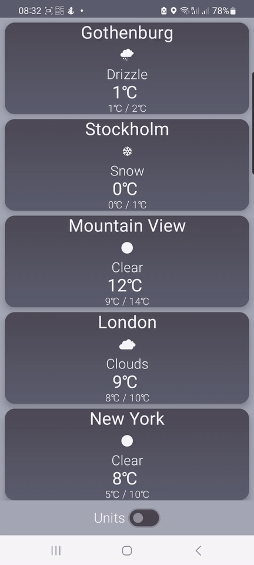

# vWeather

An example weather application made with Kotlin and Jetpack compose

## Assumptions

The application is an example application with the following assumptions made:
- The application fetches the weather info (temp, min/max temp, and description for set 6 cities)
- The application allows users to select the measurement system
- The application allows users to "pull-to-refresh" to fetch the latest data
- The application caches newest data in a local cache so it can be used while offline
- The application does not implement a seperate light/dark mode theme

## Architecture

- The application uses a layer based modularization strategy and clean architecture which split the source code into 3 modules (data, domain and presentation) along with the app module binding it all together.
- The application employs a repository pattern with an abstract repository interface, which is implemented both by the actual implementation and the
fake implementation used in tests.
- The application utilizes the MVI pattern, where the Weather has an accompanying WeatherViewModel.
- UI Components are broken down and implemented in their own files within the presentation.components package using Jetpack Compose
- Dagger-Hilt is used to provide DependencyInjection (see the di packages)

## Data Layer

- The data layer hosts the classes and files for API integration, local Room DB creation as well as the Room DAO.
- The data layer hosts the real implementation of the repository

## Domain Layer

- The domain layer is the link between the data and presentation layers
- The domain layer hosts the models, use cases, mappers and the repository abstraction

## Presentation Layer

- The presentation layer holds the UI components and the WeatherScreen UI and VM
